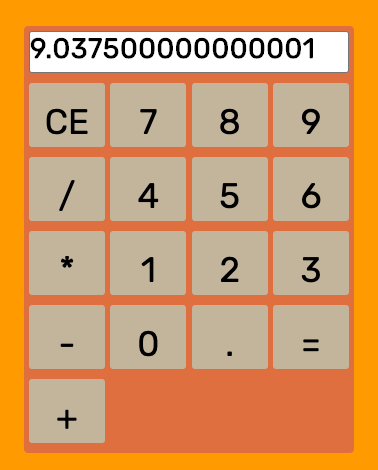

# Calculator App (Vanilla Javascript)

A calculator that can add, subtract, multiply and divide in any number and decimal up to 10 digits.  It also features a clear button for resetting your calculations.  For a live running version go to my GitHub Page  - [HERE](https://ram071985.github.io/calculator/) or at [Codepen](https://codepen.io/reid-muchow/pen/xxbYXVO)

## Summary

This app was a lot of fun to put together and it was never short of challenges while designing and writing it.  I was able to really work with functions and their parameters and their ability to be called upon by click event listeners.  Another aspect of this app that sharpened my developing skills was coming up with the logic of the conditional statments that display the numbers.  I decided to use flex-box for my layout and this app helped make my flex-box understanding reach higher ground.  I really enjoyed the process of using google dev tools to debug and problem solve during construction.  All in all, I am very happy to have this app in my collection!

## Features

- Full set of number, addition, subtraction, multiplication and division keys
- Equal key that performs all basic math calculations
- Display screen holding up to 10 digits
- CE or clear button to reset calculations

## Author 

* **Reid Muchow** - *Front-End Software Developer* - [Website](https://www.reidmuchow.com) | [LinkedIn](https://www.linkedin.com/in/reidmuchow/)

